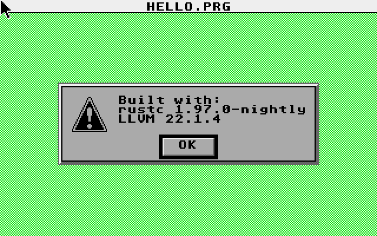
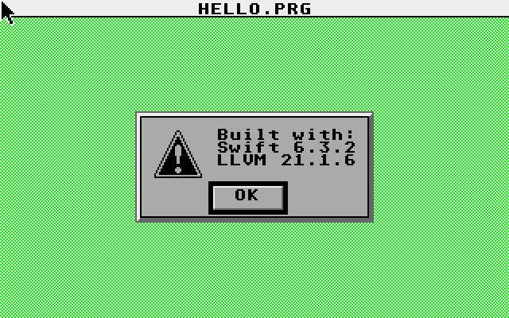
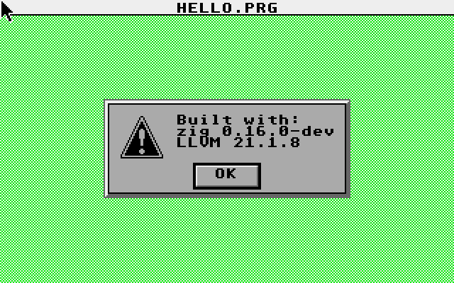
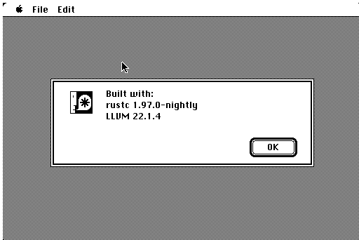
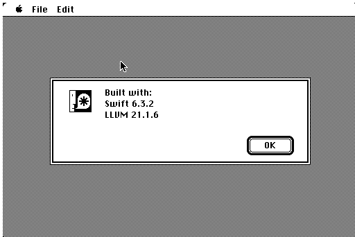
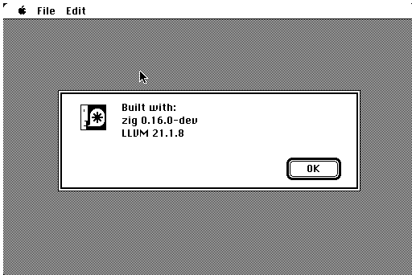

# modern-m68k-toolchains

## Intro

This is a silly PoC that I'd been wanting to try since I learned that the LLVM
backend had M68k support.

Outside of the Atari / Rust and Atari / Zig toolchains, this was all largely
vibe-coded due to me not having much experience with Swift or Mac. These toolchains 
largely rely on inline assembly to make things work, and exclude things like 
applicable runtimes or stdlib. This inline ASM could certainly be extracted out into
platform-specific libraries, and in the case of Rust, I have a feeling things like
the Embassy async framework could also be ported/adopted.

Each port is a self-contained "hello world": it opens a native alert dialog
showing the language and LLVM versions it was built with, then exits cleanly.

> **Status:** proof-of-concept, complete. Six working ports across two target
> systems. Prebuilt binaries are committed so you can run them without reconstructing
> the toolchains.

## The ports

> **Safety checks** (array-bounds, integer-overflow, …) are off in the Swift and Zig
> builds — Swift via `Unchecked`, Zig via `ReleaseSmall` — on both targets, to match
> the Rust/Zig release posture. They can be turned back on for minimal cost: for these
> hello-world programs re-enabling Swift's checks (dropping `Unchecked`) is
> **byte-for-byte free** (nothing on the live path is ever indexed or overflows), and
> enabling Zig's runtime safety in place with `@setRuntimeSafety(true)` adds only
> **~30–40 B** while keeping the size-optimized build. (Rust already keeps slice-bounds
> checks on in release — only its integer-overflow checks are off.)

### Atari TOS — GEMDOS `.PRG`

| Language | Built with | Approach | `.PRG` size | Dir |
| --- | --- | --- | --- | --- |
| **Rust** | Rust nightly / LLVM 22.1.4 | `#![no_std]`, custom `m68k-tos.json` target spec, build-std | 506 B | [`atari-tos/rust`](atari-tos/rust) |
| **Swift** | Swift 6.3.2 / LLVM 21.1.6 | **Embedded Swift** (`-enable-experimental-feature Embedded`), no stdlib runtime; m68k trap glue in `gemdos.c`; size config matched to Rust/Zig (`-function-sections` + `--gc-sections`, `Unchecked`) | 581 B | [`atari-tos/swift`](atari-tos/swift) |
| **Zig** | Zig (custom build) / LLVM 21.1.8 | `freestanding`, no std, every syscall is inline m68k asm | 439 B | [`atari-tos/zig`](atari-tos/zig) |

All three strip the PRG symbol table uniformly at the shared `toslink -s` step, so the
sizes above are like-for-like regardless of what each compiler strips upstream.

Each running under Hatari + EmuTOS:

| Rust | Swift | Zig |
| --- | --- | --- |
| [](atari-tos/rust/screenshot.png) | [](atari-tos/swift/screenshot.png) | [](atari-tos/zig/screenshot.png) |

All three share the same back-end pipeline:

```
<language compiler>  ->  m68k ELF object(s)
m68k-elf-ld --relocatable --script=prg.ld  ->  hello.elf
toslink (from toslibc)  ->  HELLO.PRG   (GEMDOS 0x601a executable)
```

### Classic Macintosh, System 1.0 — `CODE`-resource `APPL`

| Language | Built with | Approach | `.bin` size | Dir |
| --- | --- | --- | --- | --- |
| **Rust** | Rust nightly / LLVM 22.1.4 | `#![no_std]`, custom `m68k-mac.json` (`pic`), Toolbox trap glue inlined in Rust asm; comptime banner | 1,152 B | [`mac-68k/rust`](mac-68k/rust) |
| **Swift** | Swift 6.3.2 / LLVM 21.1.6 | **Embedded Swift**, Mac Toolbox trap glue in `mactraps.c`; a `NoteAlert` dialog driven via `ParamText` | 2,048 B | [`mac-68k/swift`](mac-68k/swift) |
| **Zig** | Zig 0.16.0-dev / LLVM 21.1.8 | `freestanding`, Toolbox trap glue inlined in Zig asm; comptime banner | 1,152 B | [`mac-68k/zig`](mac-68k/zig) |

The `.bin` is a MacBinary II file (128-byte header + a resource fork padded to
128-byte boundaries), so the figures above quantize; the raw `CODE` blobs are
**506 B** (Rust), **490 B** (Zig), and **1,372 B** (Swift). Swift's is larger
mostly because its banner string is copied into a Pascal buffer at runtime and
its A5-world buffers are bigger — the Rust/Zig ports assemble the banner at
compile time. (The same Toolbox bootstrap — QuickDraw/Dialog init + menu bar —
is why every Mac binary dwarfs its Atari counterpart, where AES's `appl_init`
does that work behind one trap.)

Running under Mini vMac (an emulated Mac 128K, 64K ROM, System 1.0):

| Rust | Swift | Zig |
| --- | --- | --- |
| [](mac-68k/rust/screenshot.png) | [](mac-68k/swift/screenshot.png) | [](mac-68k/zig/screenshot.png) |

The Mac 128K's MC68000 + 64K ROM is the same CPU as the Atari, but the
executable format is entirely different — there is no `toslink`. A classic
`CODE` segment is loaded anywhere and **never relocated**, so the code must be
fully PC-relative; packaging is its own stage:

```
<language compiler>  ->  m68k ELF object(s)
m68k-elf-ld --script=common/app.ld  ->  app.elf   (flat, base 0, PC-relative)
m68k-elf-objcopy -O binary          ->  app.bin
common/tools/elf2appl.py  ->  CODE 0 (jump table) + CODE 1 (code) -> HELLO.bin (MacBinary II)
```

This output stage is language-agnostic, so the three Mac ports share one copy of
it in [`mac-68k/common`](mac-68k/common) (link script, CODE-resource packaging,
MFS/HFS disk writer, 68000-safety check); only the front-end differs. See
[`mac-68k/swift`](mac-68k/swift) for the full story (CODE-resource layout, the
`-fpic` requirement, and the disk tooling needed to boot it on a real System 1.0
floppy).

## Reproducing the builds

This is the involved part — every port needs a toolchain whose **LLVM was
built with the experimental M68k backend enabled**
(`LLVM_EXPERIMENTAL_TARGETS_TO_BUILD=M68k`), plus **m68k-elf binutils**
(`m68k-elf-ld`, `m68k-elf-as`, `m68k-elf-objcopy`). Then, per target:

- **Atari TOS:** **`toslink`** from
  [frno7/toslibc](https://github.com/frno7/toslibc) (ELF → GEMDOS `.PRG`), and
  **[Hatari](https://hatari.tuxfamily.org/)** + an **EmuTOS** image for testing.
- **Classic Macintosh:** the in-tree `mac-68k/common/tools/` (CODE-resource
  packaging + MFS/HFS disk writers, shared by all three Mac ports), **Mini vMac**
  + a 64K Mac ROM and a System 1.0 disk for testing.

Per-language toolchain notes and exact build flags live in each port's own
`README.md` and `Makefile`. Each `Makefile` has its toolchain-prefix variables
at the top; edit those to point at wherever you built yours.

## Layout

```
modern-m68k-toolchains/
├── README.md            # you are here
├── LICENSE              # MIT
├── atari-tos/           # target system  -> GEMDOS .PRG
│   ├── rust/
│   ├── swift/
│   └── zig/
└── mac-68k/             # target system  -> classic Mac CODE-resource APPL
    ├── common/          # shared, language-agnostic Mac output stage
    ├── rust/
    ├── swift/
    └── zig/
```

The repo is organized by **target system** then **language**, leaving room to add
other m68k platforms (Amiga, Sega Genesis, …) or other languages later. Each
language/target is a self-contained port; the one shared piece is
`mac-68k/common/` (the Mac packaging stage, identical across the three Mac
languages — the Atari side needs no equivalent, as its `toslink` step is a
prebuilt binary).

## Credits

The Rust port began life as the standalone
[`DominoTree/RuST`](https://github.com/DominoTree/RuST) repository. The
`toslink` tool and the GEMDOS/AES conventions come from frno7's excellent
[toslibc](https://github.com/frno7/toslibc).
